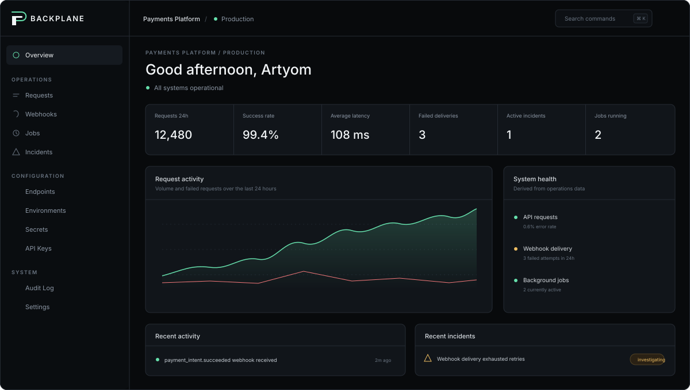
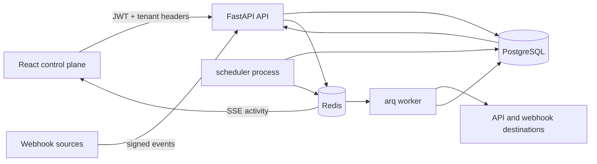

# BACKPLANE

**An open-source operations control plane for APIs, webhooks and background automation.**



BACKPLANE gives a developer or small engineering team one place to register external APIs, execute
requests, inspect inbound webhooks, operate delivery retries, schedule background work, track
incidents, and audit every sensitive action. PostgreSQL is the source of truth; Redis carries jobs
and real-time activity, and every metric on the overview is computed from stored operations data.

## Why Backplane

Integration failures are usually spread across application logs, queue dashboards, webhook vendor
pages, cron hosts, and private runbooks. BACKPLANE brings the operational path together without
pretending to replace a full observability stack. It is deliberately optimized for the moment when
someone needs to answer: _what failed, what was retried, and what changed?_

## Features

- Multi-tenant organizations, projects, environments, and backend-enforced owner/admin/developer/viewer roles
- JWT access tokens, refresh-token rotation, scrypt password hashing, and scoped hashed API keys
- Encrypted secret vault and encrypted endpoint authentication configuration
- API endpoint registry and a two-pane request console with persisted response history
- Public webhook inbox with payload limits, rate limiting, HMAC verification, and event inspection
- Reliable webhook forwarding with 1m/5m/15m backoff, delivery attempts, replay, and dead-letter handling
- Redis-backed background jobs plus a timezone-aware cron scheduler using PostgreSQL row locking
- Automatic incidents for repeated endpoint 5xx responses, exhausted deliveries, and terminal job failures
- Audit trail, persisted activity feed, Server-Sent Events, and real database-derived telemetry
- Structured logs, request IDs, Prometheus metrics, health probes, migrations, seed data, and CI

## Architecture



The backend is a modular monolith. Domain modules own their models, schemas, routers, and business
logic, while security, errors, pagination, encryption, logging, and outbound-network policy live in
small shared core modules. The worker and scheduler use the same domain services and database
invariants as HTTP requests.

## Interface

The desktop-first interface includes dedicated views for the overview, request console, webhook
inspector, jobs and schedules, incident timeline, endpoint registry, environments, secret vault,
API keys, audit records, and organization membership. It is responsive down to mobile navigation
and preserves keyboard focus, loading, empty, error, and confirmation states. Press `Ctrl+K` or
`Cmd+K` anywhere to open the command palette.

## Quick start

Requirements: Docker with Compose v2 and `make` (or run the equivalent Compose commands directly).

```bash
cp .env.example .env
make dev
```

In another terminal, load deterministic portfolio data:

```bash
make seed
```

Open [http://localhost:8080](http://localhost:8080) and sign in with:

```text
demo@backplane.dev
backplane-demo
```

The API documentation is available at [http://localhost:8000/docs](http://localhost:8000/docs) in
development. `make dev` runs PostgreSQL, Redis, the migration job, API, worker, scheduler, and web UI.

## Environment variables

| Variable | Purpose | Local default |
| --- | --- | --- |
| `DATABASE_URL` | Async SQLAlchemy PostgreSQL DSN | Compose PostgreSQL |
| `REDIS_URL` | Queue, rate-limit, and activity Redis DSN | Compose Redis |
| `JWT_SECRET` | JWT signing secret, minimum 32 characters | replace before deployment |
| `ENCRYPTION_KEY` | Independent passphrase used to derive the Fernet key | replace before deployment |
| `CORS_ORIGINS` | JSON list of allowed browser origins | local UI origins |
| `TRUSTED_HOSTS` | JSON list accepted by the host middleware | local service names |
| `PUBLIC_API_URL` | Base URL shown for inbound webhooks | `http://localhost:8000` |
| `MAX_WEBHOOK_BYTES` | Maximum accepted webhook body | 1 MiB |
| `WEBHOOK_RATE_LIMIT` | Per-source/per-endpoint events per minute | 120 |
| `ALLOW_PRIVATE_NETWORKS` | Permit outbound requests to private/reserved IPs | `false` |

See [.env.example](.env.example) for the complete list. JWT and encryption values must be independent
random secrets outside local development.

## API

Authenticated application routes live under `/api/v1`:

```text
/auth                 registration, login, refresh rotation, logout, current user
/organizations        organization settings and membership
/projects             tenant-scoped projects
/environments         runtime environments and non-secret variables
/endpoints             reusable outbound API definitions
/requests             request execution and paginated history
/webhooks             endpoints, destinations, inbox, replay, retry
/jobs                  job executions and retries
/scheduled-jobs        timezone-aware cron schedules
/incidents             detection, lifecycle, and timeline
/secrets               create, rotate, list metadata, delete
/api-keys              create-once keys, scopes, usage, revoke
/audit                 paginated attribution log
/activity              recent activity and SSE stream
/telemetry/dashboard   database-derived overview metrics
```

Application requests carry `X-Organization-ID`, `X-Project-ID`, and where relevant
`X-Environment-ID`. Each identifier is verified against the authenticated principal. API keys may
only call request, webhook, and job routes covered by their explicit scopes.

## Testing and quality

```bash
make test
make lint
make build
docker compose config --quiet
```

The pytest suite covers authentication and refresh reuse, project tenant isolation, RBAC, webhook
signatures and dead-letter incidents, job retries, API-key hashing, and repeated-5xx incident
detection. CI independently checks the Python and TypeScript builds.

## Security notes

- Passwords use scrypt with a per-password random salt.
- Refresh tokens are one-time sessions: successful refresh revokes and replaces the previous token.
- Secret and endpoint credential values are encrypted before persistence and never returned after creation.
- API keys are stored only as SHA-256 hashes; the raw key is shown once.
- Outbound URLs are restricted to HTTP(S), reject embedded credentials, do not follow redirects, and
  block private, loopback, link-local, multicast, and reserved addresses by default.
- Webhooks enforce a configurable payload ceiling and Redis-backed rate limit.
- Error responses use a stable envelope and do not expose stack traces.

These controls are a practical baseline, not a certification. A public deployment should add TLS,
managed secret storage or KMS integration, edge rate limiting, backup/restore procedures, and an
environment-specific network egress policy.

## Project structure

```text
backplane/
├── backend/
│   ├── alembic/                 explicit schema migrations
│   ├── app/
│   │   ├── api/                 dependency and routing composition
│   │   ├── auth/ organizations/ projects/ environments/
│   │   ├── endpoints/ requests/ webhooks/ jobs/ incidents/
│   │   ├── secrets/ api_keys/ audit/ telemetry/
│   │   ├── core/ db/ workers/
│   │   └── main.py
│   └── tests/
├── frontend/
│   └── src/
│       ├── components/          layout, command palette, UI primitives
│       ├── pages/               product surfaces
│       ├── providers/           auth and workspace state
│       └── lib/                 API client and formatting
├── .github/workflows/ci.yml
├── docker-compose.yml
└── Makefile
```

## Roadmap

- PostgreSQL-backed retention policies and export
- Configurable incident detection thresholds
- OpenTelemetry trace correlation
- SSO/SAML and organization invitation delivery
- Pluggable KMS providers for envelope encryption
- Destination-level concurrency and circuit breakers

## License

[MIT](LICENSE)

