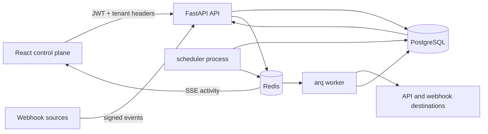

# BACKPLANE

[English](README.md) | **Русский**

**Operations control plane для API, webhook-интеграций и фоновой автоматизации.**

FastAPI • React • PostgreSQL • Redis • Docker

BACKPLANE даёт разработчику или небольшой команде единое место для регистрации внешних API, выполнения запросов, просмотра входящих webhook'ов, управления повторными доставками, запуска фоновых задач, отслеживания инцидентов и аудита чувствительных действий.

## Зачем нужен проект

Проблемы интеграций обычно размазаны по application logs, webhook-панелям, cron-хостам, очередям и внутренним инструкциям. BACKPLANE объединяет этот операционный путь и помогает быстро ответить на три вопроса: **что сломалось, что было повторено и что изменилось?**

## Основные возможности

- multi-tenant organizations, projects и environments;
- backend-enforced роли owner/admin/developer/viewer;
- JWT authentication, refresh-token rotation и scoped API keys;
- encrypted secret vault и хранение endpoint credentials;
- реестр внешних API endpoints;
- request console с историей ответов;
- public webhook inbox с HMAC verification и rate limiting;
- надёжная webhook delivery с backoff, retries, replay и dead-letter handling;
- фоновые задачи через Redis;
- timezone-aware cron scheduler;
- автоматические incidents при повторных 5xx, исчерпанных доставках и terminal job failures;
- audit trail и activity feed;
- Server-Sent Events;
- Prometheus metrics, structured logs и health probes;
- Alembic migrations, seed data, tests и CI.

## Архитектура



PostgreSQL является source of truth. Redis используется для очередей, rate limits и real-time activity. Backend построен как modular monolith, а worker и scheduler используют те же business invariants, что и HTTP API.

## Интерфейс

Веб-интерфейс включает:

- overview;
- API request console;
- webhook inspector;
- jobs и schedules;
- incident timeline;
- endpoint registry;
- environments;
- secret vault;
- API keys;
- audit log;
- управление участниками организации.

## Быстрый запуск

Нужны Docker Compose v2 и `make` или эквивалентные команды Docker Compose.

```bash
cp .env.example .env
make dev
```

Загрузить demo-данные:

```bash
make seed
```

Открыть:

- Web UI: `http://localhost:8080`
- Swagger: `http://localhost:8000/docs`

Demo login:

```text
demo@backplane.dev
backplane-demo
```

## Проверка качества

```bash
make test
make lint
make build
docker compose config --quiet
```

Тесты покрывают authentication и refresh reuse, tenant isolation, RBAC, webhook signatures, dead-letter incidents, retries, API-key hashing и repeated-5xx incident detection.

## Безопасность

- пароли хешируются через scrypt;
- refresh tokens одноразовые и ротируются;
- секреты шифруются перед сохранением;
- API keys хранятся только как SHA-256 hashes;
- исходящие URL проходят SSRF-oriented проверки;
- webhook payload имеет лимит размера и rate limit;
- error responses не раскрывают stack traces.

## Что демонстрирует проект

BACKPLANE показывает full-stack product engineering вокруг реальной backend-задачи: FastAPI, React, PostgreSQL, Redis, multi-tenancy, security, reliable webhooks, background jobs, observability и operational tooling.

## License

MIT.
